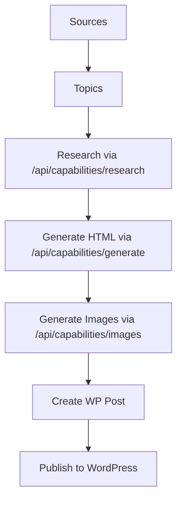

# Campaigns Feature Architecture

## Purpose
Automated content campaign execution for WP Sites - source topics, generate content, publish.

---

## FSD Structure

```
features/campaigns/
├── index.ts              # Barrel exports
├── api/                  # Internal APIs (if any)
├── lib/
│   ├── generators.ts         # Research, content, image generation
│   ├── htmlPrompts.ts        # Direct HTML content prompts
│   ├── prompts.ts            # Research prompts
│   ├── contentSpinner.ts     # Article variation
│   ├── analytics.ts          # Performance tracking
│   ├── scheduler.ts          # Campaign scheduling
│   └── pipeline.ts           # Execution pipeline
├── model/
│   ├── campaignStore.ts      # Zustand store
│   └── types.ts              # Type definitions
├── templates/
│   └── campaignTemplates.ts  # Pre-built templates
└── ui/
    ├── CampaignsDashboard.tsx
    ├── CampaignEditor.tsx
    ├── CampaignRunner.tsx
    └── SourceSelector.tsx
```

---

## Campaign Pipeline



---

## Key Types

```typescript
interface Campaign {
    id: string;
    name: string;
    siteId: string;      // Target WP Site
    
    // Execution
    status: 'draft' | 'running' | 'paused' | 'complete';
    itemsTotal: number;
    itemsComplete: number;
    
    // AI Config
    aiConfig: {
        provider?: string;
        articleType: 'pillar' | 'listicle' | 'how-to' | 'review';
        targetLength: number;
        includeFAQ: boolean;
    };
}
```

---

## Capabilities Used

| Capability | Purpose |
|------------|---------|
| `research` | Topic research and expansion |
| `generate` | Direct HTML article content |
| `images` | Featured image generation |

---

## Integration

- **Target**: WP Sites only (`useWPSitesStore`)
- **Publishing**: Direct WordPress REST API via `createPost()`
- **AI**: Unified `/api/capabilities/[capability]` pattern
