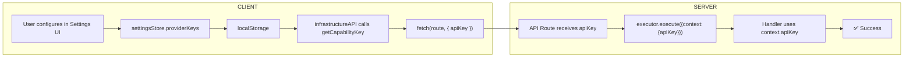

# Capability System Architecture Guidelines

## Purpose
This document defines **MANDATORY** patterns for using AI capabilities in Ifrit.
Follow these rules to avoid architecture violations.

---

## Golden Rule: Features Are Agnostic

**Features NEVER:**
- Handle API keys
- Know which provider is used
- Access localStorage for keys
- Pass keys to API routes

**Features ONLY:**
- Declare which capability they need
- Pass context/prompt
- Receive progress updates
- Display status to user

---

## Correct Pattern

### 1. Feature Layer (Component)
```tsx
// ✅ CORRECT - Feature doesn't know about keys
const { generateProfile, profileProgress } = useStore();

const handleGenerate = async () => {
    await generateProfile(domain, keywordContext);
    // Progress shown via profileProgress state
};

// Display status
{profileProgress && (
    <StatusIndicator 
        phase={profileProgress.phase}
        message={profileProgress.message}
    />
)}
```

### 2. Store Layer
```tsx
// ✅ CORRECT - Store passes progress callback
generateProfile: async (domain, keywordContext) => {
    set({ profileProgress: { phase: 'starting', message: 'Starting...' } });
    
    await generateProfileUseCase(
        { domain, keywordContext },
        (progress) => set({ profileProgress: progress })
    );
}
```

### 3. Use Case Layer
```tsx
// ✅ CORRECT - Use case orchestrates, no keys
export async function generateProfileUseCase(
    options: { domain: string; keywordContext?: KeywordContext },
    onProgress: (status: ActionStatus) => void
) {
    onProgress(ActionStatusFactory.running('Generating...'));
    
    const result = await generateDomainProfile(options.domain, {
        keywordContext: options.keywordContext,
        onProgress,  // Pass progress through
    });
    
    // ...
}
```

### 4. Infrastructure Layer
```tsx
// ✅ CORRECT - API just passes capability request
export async function generateDomainProfile(domain, options) {
    const response = await fetch('/api/domain-profiles/generate', {
        method: 'POST',
        body: JSON.stringify({
            domain,
            keywordContext: options.keywordContext,
            // NO apiKey - route gets from Settings
        }),
    });
}
```

### 5. Route Layer
```tsx
// ✅ CORRECT - Route uses capability system
export async function POST(request) {
    const { aiServices } = await import('@/lib/ai/services');
    await aiServices.initialize();
    
    // AIServices gets keys from settingsStore automatically
    const result = await aiServices.execute({
        capability: 'keywords',
        prompt: buildPrompt(body),
        onProgress: (p) => {
            // For SSE streaming later
        },
    });
}
```

---

## Wrong Patterns (NEVER DO)

### ❌ Feature handling keys
```tsx
// WRONG - Feature knows about keys
const apiKey = localStorage.getItem('gemini_api_key');
await generateProfile(domain, apiKey);
```

### ❌ Route accepting keys
```tsx
// WRONG - Route receives key from client
interface Request {
    apiKey?: string;  // ← NEVER
}
await aiServices.executeWithKeys(..., { gemini: [apiKey] });
```

### ❌ No UI feedback
```tsx
// WRONG - Only console logs
console.log('Generating...');
await generateProfile(domain);
console.log('Done');
// User sees nothing!
```

---

## Settings Integration

### How Keys Flow (CLIENT→SERVER Pattern):

> [!IMPORTANT]
> Server routes CANNOT access client localStorage. Keys must flow from CLIENT to SERVER.



### Standard Pattern:
1. **CLIENT** retrieves key using `getCapabilityKey()` helper
2. **CLIENT** passes key in request body: `{ ...data, apiKey }`
3. **SERVER** passes key to executor: `executor.execute({ context: { apiKey } })`

### Key Storage Location:
- **Correct:** `ifrit_settings_store.state.providerKeys`
- **Wrong:** `gemini_api_key`, `GEMINI_API_KEY`, env vars, etc.

---

## UI Accountability

Every capability call MUST show status:

| Phase | UI Feedback |
|-------|-------------|
| Starting | Spinner + "Starting..." |
| Handler | "Trying Gemini..." → "Trying DeepSeek..." |
| Success | Green check + "Complete" |
| Failure | Red X + actionable message |

### onProgress Structure:
```typescript
onProgress({
    phase: 'starting' | 'handler' | 'complete',
    message: string,
    handlerId?: string,
    handlerName?: string,
    success?: boolean,
    error?: string,
});
```

---

## Checklist Before Coding

1. [ ] Feature doesn't import localStorage for keys?
2. [ ] Feature doesn't pass apiKey to store/use case?
3. [ ] Route uses `execute()` not `executeWithKeys()`?
4. [ ] UI has state for progress display?
5. [ ] onProgress callback flows through layers?

---

## Files Reference

| Layer | File | Responsibility |
|-------|------|----------------|
| Feature | `components/.../Feature.tsx` | UI, progress display |
| Store | `stores/featureStore.ts` | State, actions |
| Use Case | `lib/application/.../useCase.ts` | Orchestration |
| Infrastructure | `lib/infrastructure/api/...API.ts` | HTTP calls |
| Route | `app/api/.../route.ts` | Calls AIServices |
| AIServices | `lib/ai/services/AIServices.ts` | Gets keys, executes |
| Settings | `stores/settingsStore.ts` | Stores keys |
