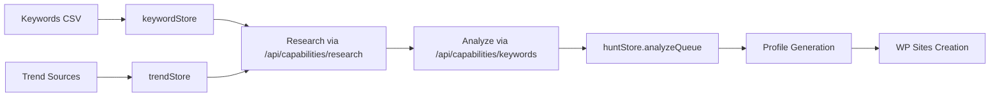

# Hunt Feature Architecture

## Purpose
Domain research and acquisition pipeline for finding profitable niches and expired domains for WP Sites.

---

## FSD Structure

```
features/hunt/
├── index.ts          # Barrel exports (stores, types, helpers)
├── lib/
│   └── huntHelpers.ts    # AI analysis helpers
└── model/
    ├── huntStore.ts           # Main workflow state
    ├── domainAcquireStore.ts  # Domain filtering/import
    ├── keywordStore.ts        # Keyword analysis
    ├── trendStore.ts          # Trend scanning
    └── flipStore.ts           # Domain flip projects

components/hunt/        # UI components (to be migrated to features/hunt/ui/)
├── HuntDashboard.tsx   # Main tab component
└── subtabs/
    ├── KeywordsNiches/ # Keyword research
    ├── DomainAcquire/  # Domain finding
    └── FlipPipeline/   # Domain flipping
```

---

## Data Flow



---

## Stores

| Store | Purpose | Persistence |
|-------|---------|-------------|
| `huntStore` | Workflow queues, owned domains | localStorage |
| `keywordStore` | CSV imports, analysis results | localStorage |
| `trendStore` | Trend scans, sources | localStorage |
| `domainAcquireStore` | Filters, imports | localStorage |
| `flipStore` | Flip projects | localStorage |

---

## Capabilities Used

| Capability | Usage |
|------------|-------|
| `research` | Keyword research, niche validation |
| `keywords` | Keyword expansion, scoring |
| `generate-profile` | Domain profile creation |

---

## Integration Points

- **Output → WP Sites**: `CreateSiteButton.tsx` creates WP Sites from analyzed domains
- **AI → Capabilities**: Uses `/api/capabilities/[capability]` pattern
- **Profiles → Storage**: Saves to `/websites/profiles/{domain}.json`

---

## Import Patterns

```typescript
// Recommended: Feature barrel
import { useHuntStore, useKeywordStore } from '@/features/hunt';

// Legacy (still works via re-exports)
import { useHuntStore } from '@/stores/huntStore';
```
