# Media System - Separation of Concerns Analysis & Refactoring Plan

This document analyzes the current media system architecture, identifies SoC violations, and provides a refactoring roadmap for fixing bugs and proper isolation.

---

## Table of Contents

1. [Current State Overview](#1-current-state-overview)
2. [SoC Violation Analysis](#2-soc-violation-analysis)
3. [Proper Layer Responsibilities](#3-proper-layer-responsibilities)
4. [Refactoring Roadmap](#4-refactoring-roadmap)
5. [Files Reference](#5-files-reference)

---

## 1. Current State Overview

### Two Parallel Systems

| System | Purpose | Media Routes | Status |
|--------|---------|--------------|--------|
| **Legacy Websites** | GitHub/Vercel static sites | `/api/websites/[domain]/images` | ❌ Deprecated |
| **WP Sites** | Hostinger/WordPress | WP REST API via `uploadMedia()` | ✅ Active |

### Media Concern Categories

```mermaid
flowchart TB
    subgraph Concerns["Media Concerns"]
        A[Key Storage]
        B[Key Retrieval Client→Server]
        C[External Service Connection]
        D[Capability Execution]
        E[Data Service - Fetch/Transform]
        F[Orchestration - Pipeline]
        G[UI Display]
    end
```



| Concern | Should Be In | Currently Mixed In |
|---------|--------------|---------------------|
| **Key Storage** | `settingsStore` only | ✅ Correct |
| **Key Retrieval** | `getCapabilityKey.ts` (client) | ⚠️ Some handlers bypass |
| **External Connection** | Handlers only | ⚠️ `stockPhotos.ts` direct access |
| **Capability Execution** | `/api/capabilities/*` routes | ⚠️ Some direct calls |
| **Data Service** | `MediaAssetService`, `imageGenerator` | ✅ Mostly correct |
| **Orchestration** | `PipelineRunner`, `wpPublisher` | ⚠️ Mixes key retrieval |
| **UI Display** | Components only | ⚠️ `StockPhotoSelector` direct API |

---

## 2. SoC Violation Analysis

### ❌ Violation 1: Handlers Access settingsStore Directly

**Files affected:**
- `lib/ai/handlers/imageSearchHandlers.ts` (lines 25-26, 124-125)

**Current (WRONG):**
```typescript
// Inside handler
if (typeof window !== 'undefined') {
    const { useSettingsStore } = await import('@/stores/settingsStore');
    apiKey = useSettingsStore.getState().integrations.unsplashKey;
}
```

**Problem:** Handlers run on server in API routes. They CANNOT access client-side stores directly. This works only when handlers are called from client, causing inconsistent behavior.

**Correct pattern:** Keys should come via `context.unsplashKey` passed from route.

---

### ❌ Violation 2: stockPhotos.ts Uses Wrong Key Pattern

**File:** `lib/images/stockPhotos.ts` (lines 56-59)

**Current (WRONG):**
```typescript
return {
    unsplash: localStorage.getItem('ifrit_unsplash_key') || undefined,
    pexels: localStorage.getItem('ifrit_pexels_key') || undefined
};
```

**Problems:**
1. Uses deprecated localStorage key names (`ifrit_unsplash_key`)
2. Correct location is `settingsStore.integrations.unsplashKey`
3. This file is in `lib/` (infrastructure) but does client-only work

---

### ❌ Violation 3: ImageGallery Uses Legacy API Routes

**File:** `components/websites/ImageGallery.tsx` (lines 72, 134, 170, 188)

**Current (WRONG for WP Sites):**
```typescript
let url = `/api/websites/${domain}/images`;
await fetch(`/api/websites/${domain}/images`, ...);
```

**Problem:** This component uses legacy `/api/websites/` routes. For WP Sites, images should go through WordPress Media Library via `uploadMedia()`.

---

### ❌ Violation 4: StockPhotoSelector Direct API Calls

**File:** `components/shared/StockPhotoSelector.tsx` (lines 46-64)

**Current (WRONG):**
```typescript
// Component reads keys from localStorage
const unsplashKey = localStorage.getItem('ifrit_unsplash_key');
const pexelsKey = localStorage.getItem('ifrit_pexels_key');

const response = await fetch('/api/stock-photos', {
    body: JSON.stringify({ unsplashKey, pexelsKey, ... })
});
```

**Problems:**
1. Component handles key retrieval (should use infrastructure layer)
2. Uses wrong localStorage key names
3. Direct API call instead of using capability system

---

### ❌ Violation 5: Feature Code Retrieves Keys

**Files:**
- `features/campaigns/lib/imageGenerator.ts` (line 145)
- `features/campaigns/lib/generators.ts` (lines 37, 124, 297)

**Current (ACCEPTABLE but inconsistent):**
```typescript
const { getAllProviderKeys, getAllIntegrationKeys } = await import('@/lib/ai/utils/getCapabilityKey');
```

**Assessment:** This is the CORRECT pattern (using infrastructure utility), but:
- Not all media code uses this pattern
- Should be used consistently everywhere

---

### ⚠️ Violation 6: Mixed Legacy and WP Sites Concerns

**Examples:**
- `ImageGallery.tsx` - Legacy component, shouldn't be used for WP Sites
- `/api/websites/[domain]/images/` - Legacy routes, not for WP Sites
- `StockPhotoSelector` - Used by both systems with inconsistent key handling

---

## 3. Proper Layer Responsibilities

### Layer Architecture

```
┌─────────────────────────────────────────────────────────────────────┐
│ UI Layer                                                            │
│ - Display images, progress, errors                                  │
│ - NO key access, NO direct API calls                                │
│ - Uses hooks/stores for actions                                     │
│ Files: components/*, features/*/ui/*                                │
└─────────────────────────────────────────────────────────────────────┘
                                    │
                                    ▼
┌─────────────────────────────────────────────────────────────────────┐
│ Store Layer                                                         │
│ - State management for media (assets, progress, errors)             │
│ - Calls infrastructure layer for API operations                     │
│ Files: stores/*, features/*/model/*                                 │
└─────────────────────────────────────────────────────────────────────┘
                                    │
                                    ▼
┌─────────────────────────────────────────────────────────────────────┐
│ Infrastructure Layer                                                │
│ - Key retrieval (getCapabilityKey, getAllIntegrationKeys)           │
│ - API calls to routes                                               │
│ - Passes keys in request body                                       │
│ Files: lib/infrastructure/api/*, lib/ai/utils/getCapabilityKey.ts   │
└─────────────────────────────────────────────────────────────────────┘
                                    │
                                    ▼
┌─────────────────────────────────────────────────────────────────────┐
│ API Route Layer                                                     │
│ - Receives keys from request body                                   │
│ - Passes keys to executor via context                               │
│ - Returns results                                                   │
│ Files: app/api/capabilities/*, app/api/wp-sites/*                   │
└─────────────────────────────────────────────────────────────────────┘
                                    │
                                    ▼
┌─────────────────────────────────────────────────────────────────────┐
│ Handler Layer                                                       │
│ - Receives keys via context.apiKey, context.unsplashKey, etc.       │
│ - Makes external API calls                                          │
│ - Returns standardized results                                      │
│ Files: lib/ai/handlers/*                                            │
└─────────────────────────────────────────────────────────────────────┘
```

### Key Flow Pattern (CLIENT→SERVER)


---

## 4. Refactoring Roadmap

### Phase 1: Fix Handler Key Access (HIGH PRIORITY)

**Goal:** Handlers must receive keys from context, not access stores directly.

| File | Change |
|------|--------|
| `imageSearchHandlers.ts` | Remove `useSettingsStore` import, use `options.context.unsplashKey` |

**Pattern:**
```typescript
// BEFORE (wrong)
if (typeof window !== 'undefined') {
    const { useSettingsStore } = await import('@/stores/settingsStore');
    apiKey = useSettingsStore.getState().integrations.unsplashKey;
}

// AFTER (correct)
apiKey = options.context?.unsplashKey as string;
if (!apiKey) {
    return { success: false, error: 'Unsplash API key not provided in context' };
}
```

---

### Phase 2: Fix Key Passing in Routes

**Goal:** Routes must pass integration keys to executor context.

| File | Change |
|------|--------|
| Capability route | Extract `unsplashKey`, `pexelsKey` from request body, pass to context |

**Pattern:**
```typescript
// In route handler
const { unsplashKey, pexelsKey, ...rest } = body;

const result = await executor.execute({
    capability: 'search-images',
    prompt,
    context: {
        unsplashKey,
        pexelsKey,
        ...rest.context,
    },
}, handlers, config);
```

---

### Phase 3: Remove Deprecated stockPhotos.ts Usage

**Goal:** Consolidate stock photo functionality into capability handlers.

| File | Action |
|------|--------|
| `lib/images/stockPhotos.ts` | Mark as deprecated, add warning comments |
| `StockPhotoSelector.tsx` | Use `search-images` capability instead of direct `/api/stock-photos` |

**Assessment:** This file serves Legacy Websites. Consider if WP Sites should use capability-based search exclusively.

---

### Phase 4: Separate Legacy from WP Sites Components

**Goal:** Clear separation of UI components.

| Component | Owner | Action |
|-----------|-------|--------|
| `ImageGallery.tsx` | Legacy | Add `@legacy` JSDoc, ensure not imported by WP Sites |
| `StockPhotoSelector.tsx` | Shared | Refactor to use infrastructure layer |
| `MediaGeneratorCard.tsx` | WP Sites | ✅ Already uses correct pattern |

---

### Phase 5: Standardize Feature Key Access

**Goal:** All feature code uses `getCapabilityKey` utilities.

| File | Current | Action |
|------|---------|--------|
| `imageGenerator.ts` | ✅ Uses `getAllProviderKeys` | Keep |
| `generators.ts` | ✅ Uses `getAllProviderKeys` | Keep |
| `useWPSiteMedia.ts` | Direct fetch, no keys | Add key passing |

---

## 5. Files Reference

### Files Needing Refactoring (Priority Order)

| Priority | File | Issue | Fix |
|----------|------|-------|-----|
| 🔴 HIGH | `lib/ai/handlers/imageSearchHandlers.ts` | Direct settingsStore access | Use `context.unsplashKey` |
| 🔴 HIGH | `app/api/capabilities/[capability]/route.ts` | Doesn't pass integration keys | Add integrationKeys to context |
| 🟡 MEDIUM | `lib/images/stockPhotos.ts` | Wrong localStorage keys | Deprecate or fix key names |
| 🟡 MEDIUM | `components/shared/StockPhotoSelector.tsx` | Direct key access | Use infrastructure layer |
| 🟢 LOW | `components/websites/ImageGallery.tsx` | Legacy only | Add @legacy annotation |

### Files with Correct Pattern (Reference)

| File | Pattern Used |
|------|--------------|
| `lib/ai/utils/getCapabilityKey.ts` | ✅ Client-side key retrieval |
| `features/campaigns/lib/imageGenerator.ts` | ✅ Uses `getAllProviderKeys` |
| `features/wordpress/ui/MediaGeneratorCard.tsx` | ✅ Uses hook, not direct keys |
| `features/wordpress/hooks/useWPSiteMedia.ts` | ✅ Uses capability routes |

---

## Summary

The media system has architectural mixing primarily around **key access patterns**:

1. **Handlers shouldn't access stores** - they receive keys via context
2. **Routes must pass keys to context** - not just prompt/options
3. **Features use `getCapabilityKey`** - infrastructure layer retrieves keys
4. **Legacy and WP Sites are separated** - different routes, different patterns

The refactoring is focused on **fixing the key flow**, not changing functionality. Once keys flow correctly through all layers, media bugs related to "API key not found" or inconsistent behavior will be resolved.
