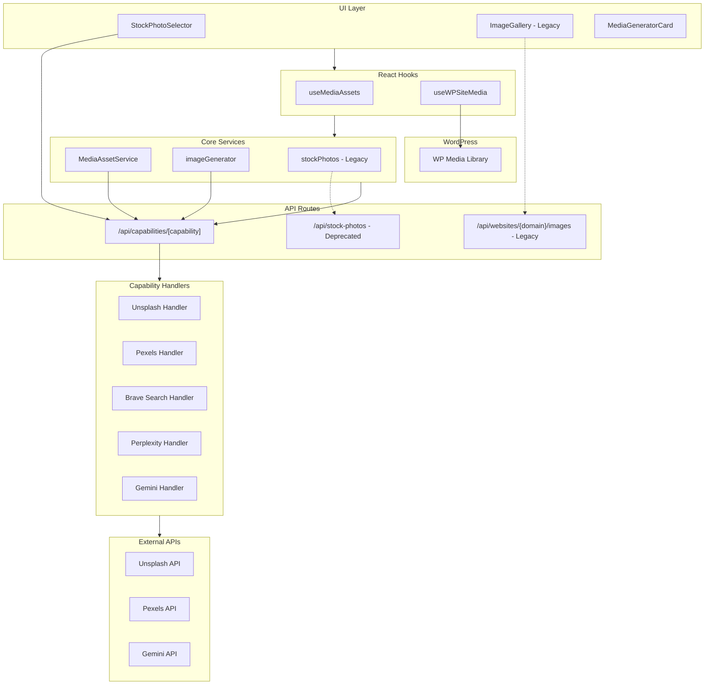

# Media System Architecture Report

This document provides a comprehensive analysis of all media (images, videos, etc.) related code in the Ifrit application, organized by functional area.

> [!NOTE]
> **Last Updated:** 2026-01-09 - Added scoring, SEO validation, and optimization modules

---

## Table of Contents

1. [Media Asset Service (Core)](#1-media-asset-service-core)
2. [Image Scoring](#2-image-scoring) ✨ NEW
3. [SEO Validation](#3-seo-validation) ✨ NEW
4. [Image Optimization](#4-image-optimization) ✨ NEW (Consolidated)
5. [Image Generation Pipeline](#5-image-generation-pipeline) ⚠️ Deprecated
6. [Stock Photo Integration](#6-stock-photo-integration) ⚠️ Legacy
7. [WordPress Media Upload](#7-wordpress-media-upload)
8. [Image Search Handlers (Capabilities)](#8-image-search-handlers-capabilities) ✅ Enhanced
9. [UI Components](#9-ui-components)
10. [Social Media Sources](#10-social-media-sources)
11. [API Routes](#11-api-routes)

---

## 1. Media Asset Service (Core)

**File:** [MediaAssetService.ts](file:///home/ubuntu/Documents/AdSence%20Ifrit%20V3%20Opus4.5/lib/media/MediaAssetService.ts)

### Purpose
Enterprise media management system with template-based image slots, AI generation, stock photo search, and local caching before WordPress upload.

### Types Defined

| Type | Purpose |
|------|---------|
| `MediaSlotType` | `'cover' \| 'inline' \| 'og-image' \| 'twitter-card'` |
| `MediaSourceType` | `'ai' \| 'unsplash' \| 'pexels' \| 'brave-search' \| 'auto'` |
| `MediaSlot` | Defines slot configuration (type, position, dimensions, source preference) |
| `MediaRequest` | Request payload for asset generation |
| `GeneratedAsset` | Complete asset with blob, metadata, dimensions, status, WP media ID |
| `ArticleTemplate` | Template with array of media slots |

### Default Templates

| Template ID | Description | Media Slots |
|------------|-------------|-------------|
| `minimal` | Cover image only | 1 cover (1200×628) |
| `standard` | Cover + 2 inline + social | 5 slots (cover, 2 inline, OG, Twitter) |
| `rich` | Cover + 4 inline + social | 7 slots with AI-preferred cover |

### Key Functions

| Function | Description |
|----------|-------------|
| `getInstance()` | Singleton accessor |
| `getTemplates()` | Returns all article templates |
| `getTemplate(id)` | Get template by ID |
| `generateForArticle()` | Generate all media assets for an article based on template |
| `generateAsset()` | Generate a single media asset with source fallback |
| `getSourceChain()` | Determines source priority (AI first or search first) |
| `fetchViaImagesCapability()` | Uses `/api/capabilities/images` for AI generation |
| `fetchViaSearchImagesCapability()` | Uses `/api/capabilities/search-images` for stock search |
| `buildPromptForSlot()` | Builds appropriate prompt based on slot type |
| `generateAltText()` | Generates SEO alt text for images |

### React Hook

**File:** [useMediaAssets.ts](file:///home/ubuntu/Documents/AdSence%20Ifrit%20V3%20Opus4.5/lib/media/hooks/useMediaAssets.ts)

| Function | Description |
|----------|-------------|
| `generateForArticle()` | Generate assets with progress tracking via GlobalActionStatus |
| `generateSingleAsset()` | Generate single cover/OG/twitter image |
| `clearAssets()` | Clear assets for an article |
| `templates` | Access to all templates |
| `getTemplate()` | Get specific template |

---

## 2. Image Scoring ✨ NEW

**File:** [scoring.ts](file:///home/ubuntu/Documents/AdSence%20Ifrit%20V3%20Opus4.5/lib/media/scoring.ts)

### Purpose
Scores images from multiple search handlers based on quality criteria to select the best image for each slot.

### Score Weights

| Criteria | Points | Description |
|----------|--------|-------------|
| Resolution | 40 | Match to target dimensions |
| Aspect Ratio | 30 | Closeness to required AR |
| Source Preference | 20 | Preferred handler bonus |
| Metadata | 10 | Alt text, photographer |

### Key Functions

| Function | Description |
|----------|-------------|
| `scoreImage()` | Score single image against criteria |
| `scoreAndRankImages()` | Score and sort multiple images |
| `pickTopImages()` | Pick top N after scoring |
| `mergeImageResults()` | Merge results from multiple handlers |
| `getDefaultCriteria()` | Default criteria for slot types |

---

## 3. SEO Validation ✨ NEW

**File:** [seoValidation.ts](file:///home/ubuntu/Documents/AdSence%20Ifrit%20V3%20Opus4.5/lib/media/seoValidation.ts)

### Purpose
Validates images for SEO best practices before publishing.

### Validation Checks

| Check | Severity | Threshold |
|-------|----------|-----------|
| Alt text missing | Error | Required |
| Alt text too short | Warning | < 10 chars |
| Alt text too long | Warning | > 125 chars |
| Keyword stuffing | Warning | > 3 repeats |
| Dimensions too small | Warning | Per slot |
| File too large | Warning | > 2MB |

### Key Functions

| Function | Description |
|----------|-------------|
| `validateImageSEO()` | Validate single image |
| `validateImagesSEO()` | Batch validation |
| `suggestAltText()` | Generate suggested alt text |
| `improveAltText()` | Fix alt text issues |

---

## 4. Image Optimization ✨ NEW (Consolidated)

**File:** [optimization.ts](file:///home/ubuntu/Documents/AdSence%20Ifrit%20V3%20Opus4.5/lib/media/optimization.ts)

> [!NOTE]
> Consolidated from `features/campaigns/lib/imageOptimization.ts`

### Key Functions

| Function | Description |
|----------|-------------|
| `generateAltText()` | Sync alt text from context |
| `generateAltTextAI()` | AI-powered alt text generation |
| `determineImagePlacements()` | Calculate optimal positions |
| `injectImages()` | Insert images into HTML content |

---

## 2. Image Generation Pipeline

**File:** [imageGenerator.ts](file:///home/ubuntu/Documents/AdSence%20Ifrit%20V3%20Opus4.5/features/campaigns/lib/imageGenerator.ts)

### Purpose
Generate images for campaign articles using AI and stock photo fallback chain.

### Types

| Type | Purpose |
|------|---------|
| `ImageType` | `'cover' \| 'inline' \| 'og-image' \| 'twitter-card'` |
| `ImageResult` | `{ url: string; alt: string }` |
| `InlineImageResult` | Extends ImageResult with position |
| `GeneratedImages` | Collection of cover and inline images |
| `ImageProgressStatus` | Progress tracking for SSE |
| `ImageProgressCallback` | Callback for progress updates |

### Key Functions

| Function | Description |
|----------|-------------|
| `generateImages()` | Main entry - generates cover and inline images with fallback chain |
| `generateSingleImage()` | Generates one image, tries AI first (if preferred) then stock search |
| `generateImagesParallel()` | Parallel generation with timeout for speed |

### Fallback Chain Logic
```
AI preferred (gemini/openrouter): ['ai', 'search']
Otherwise: ['search', 'ai']  // Stock first (free)
```

---

## 3. Stock Photo Integration

> [!WARNING]
> **@legacy** - This module uses deprecated key names and should not be used by WP Sites.
> Modern code should use `/api/capabilities/search-images` instead.

### Stock Photos Module

**File:** [stockPhotos.ts](file:///home/ubuntu/Documents/AdSence%20Ifrit%20V3%20Opus4.5/lib/images/stockPhotos.ts)

### Types

| Type | Purpose |
|------|---------|
| `StockPhoto` | Photo metadata (id, url, thumbUrl, dimensions, alt, attribution, source) |
| `FetchedImage` | Downloaded image with local path and metadata |

### Functions

| Function | Description |
|----------|-------------|
| `getStockApiKeys()` | Gets Unsplash/Pexels keys from localStorage or env |
| `searchUnsplash()` | Search Unsplash API for landscape photos |
| `searchPexels()` | Search Pexels API for landscape photos |
| `searchPhotos()` | Tries Unsplash first, falls back to Pexels |
| `downloadFile()` | Downloads file from URL to local path |
| `downloadAndSaveImage()` | Downloads and saves stock photo with metadata |
| `fetchCoverImage()` | High-level function to fetch article cover |
| `fetchContentImages()` | Fetch multiple content images for an article |
| `hasStockPhotoApi()` | Check if any stock API is configured |

---

## 4. WordPress Media Upload

### WordPress API

**File:** [wordpressApi.ts](file:///home/ubuntu/Documents/AdSence%20Ifrit%20V3%20Opus4.5/features/wordpress/api/wordpressApi.ts)

| Function | Description |
|----------|-------------|
| `uploadMedia()` | Uploads image to WordPress Media Library via WP REST API |

**Parameters:**
- `site: WPSite` - WordPress site configuration
- `media: WPMediaInput` - File, filename, mimeType, alt_text, caption, title

**Returns:** `WPApiResponse<WPMediaResult>` with `id` and `source_url`

---

### WP Site Media Hook

**File:** [useWPSiteMedia.ts](file:///home/ubuntu/Documents/AdSence%20Ifrit%20V3%20Opus4.5/features/wordpress/hooks/useWPSiteMedia.ts)

### Types

| Type | Purpose |
|------|---------|
| `GeneratedMediaAsset` | `{ url, alt, wpMediaId?, wpMediaUrl?, source: 'ai' \| 'stock' }` |
| `UseWPSiteMediaReturn` | Hook return type with state and actions |

### Functions

| Function | Description |
|----------|-------------|
| `searchStockImage()` | Search stock via `/api/capabilities/search-images` |
| `generateAIImage()` | Generate via `/api/capabilities/images` |
| `generateFeaturedImage()` | Tries stock first (free), then AI fallback |
| `uploadToMediaLibrary()` | Downloads image and uploads to WP Media Library |
| `clearImage()` | Clear generated image state |

---

### WordPress Publisher

**File:** [wpPublisher.ts](file:///home/ubuntu/Documents/AdSence%20Ifrit%20V3%20Opus4.5/features/campaigns/lib/wpPublisher.ts)

| Function | Description |
|----------|-------------|
| `uploadCoverImage()` | Upload cover image to WP, returns media ID |
| `processInlineImages()` | Upload inline images and inject into HTML content |
| `publishToWordPress()` | Full publish with image upload |
| `retryImagesForPost()` | Retry image generation for existing post |

---

## 5. Image Search Handlers (Capabilities)

**File:** [imageSearchHandlers.ts](file:///home/ubuntu/Documents/AdSence%20Ifrit%20V3%20Opus4.5/lib/ai/handlers/imageSearchHandlers.ts)

### Handlers for `search-images` Capability

| Handler | Priority | Requires API Key | Function |
|---------|----------|------------------|----------|
| `unsplash` | 90 | Yes (`unsplashKey`) | Searches Unsplash API |
| `pexels` | 85 | Yes (`pexelsKey`) | Searches Pexels API |
| `brave-search` | 70 | No (uses research) | Uses research capability to find free images |
| `perplexity-images` | 75 | No (uses research) | AI-powered image search via Perplexity |

### Handler Functions

| Function | Description |
|----------|-------------|
| `executeUnsplash()` | Direct Unsplash API search, returns array of image objects |
| `executePexels()` | Direct Pexels API search |
| `executeBraveSearch()` | Uses research capability to find commercially usable images |
| `executePerplexity()` | Uses Perplexity research to find image URLs |

### Return Structure
```typescript
{
  success: boolean;
  data: Array<{ id, url, thumbnailUrl, alt, attribution, sourceUrl, source }>;
  text: string;  // First image URL for simple usage
  handlerUsed: string;
  latencyMs: number;
}
```

---

## 6. UI Components

### Stock Photo Selector ✅ FIXED

**File:** [StockPhotoSelector.tsx](file:///home/ubuntu/Documents/AdSence%20Ifrit%20V3%20Opus4.5/components/shared/StockPhotoSelector.tsx)

**Purpose:** Modal dialog for searching and selecting stock photos from Unsplash/Pexels.

**Functions:**
| Function | Description |
|----------|-------------|
| `searchPhotos()` | Uses `/api/capabilities/search-images` with `getAllIntegrationKeys()` |
| `handleSelect()` | Calls `onSelect` callback with selected photo |

**Features:**
- Search input with Enter key support
- 3-column photo grid with selection
- Source badge (Unsplash/Pexels)
- Photographer attribution on hover
- Selected photo confirmation

---

### Image Gallery ⚠️ LEGACY

**File:** [ImageGallery.tsx](file:///home/ubuntu/Documents/AdSence%20Ifrit%20V3%20Opus4.5/components/websites/ImageGallery.tsx)

> [!CAUTION]
> **@legacy** - This component is for Legacy Websites only.
> For WP Sites, use WordPress Media Library via `uploadMedia()`.

**Purpose:** Display and manage images for articles with CRUD operations.

**Types:**
| Type | Purpose |
|------|---------|
| `ImageInfo` | Image metadata (id, url, filename, type, articleSlug, alt, caption, size, createdAt) |

**Features:**
- Grid view of all images
- Drag & drop upload zone
- Filter by article and type (cover/content/orphaned)
- Edit alt text and captions
- Delete unused images
- Picker mode for selection

**Functions:**
| Function | Description |
|----------|-------------|
| `fetchImages()` | GET `/api/websites/{domain}/images` |
| `handleUpload()` | POST `/api/websites/{domain}/images` with FormData |
| `handleDelete()` | DELETE `/api/websites/{domain}/images` |
| `handleSaveEdit()` | PATCH `/api/websites/{domain}/images` |
| `formatSize()` | Format bytes to KB/MB |

---

### Media Generator Card

**File:** [MediaGeneratorCard.tsx](file:///home/ubuntu/Documents/AdSence%20Ifrit%20V3%20Opus4.5/features/wordpress/ui/MediaGeneratorCard.tsx)

**Purpose:** On-demand image generation UI for WP Sites with mode toggle (Stock vs AI).

**Features:**
- Topic/keyword input
- Mode toggle: Stock (Free) vs AI Generate
- Image preview with source badge
- Upload to WordPress button
- SSE progress tracking via GlobalActionStatus

**Functions:**
| Function | Description |
|----------|-------------|
| `handleGenerate()` | Calls `searchStockImage()` or `generateAIImage()` based on mode |
| `handleUpload()` | Uploads generated image to WP Media Library |

---

## 7. Social Media Sources

These modules handle media from social platforms, primarily for content inspiration.

### Instagram API

**File:** [instagramApi.ts](file:///home/ubuntu/Documents/AdSence%20Ifrit%20V3%20Opus4.5/features/sources/lib/instagramApi.ts)

**Types:**
| Type | Purpose |
|------|---------|
| `InstagramMedia` | Media object with id, type (IMAGE/VIDEO/CAROUSEL), urls, engagement |
| `InstagramUser` | User profile with followers, media count |

**Media-related Functions:**
| Function | Description |
|----------|-------------|
| `getInstagramMediaUrl()` | Get best media URL (handles video thumbnails) |
| `getCarouselImages()` | Extract all images from CAROUSEL_ALBUM |

---

### Facebook API

**File:** [facebookApi.ts](file:///home/ubuntu/Documents/AdSence%20Ifrit%20V3%20Opus4.5/features/sources/lib/facebookApi.ts)

**Types:**
| Type | Purpose |
|------|---------|
| `FacebookPost` | Post with full_picture, attachments |
| `FacebookAttachment` | Media attachment (photo/video/album) |

**Media-related Functions:**
| Function | Description |
|----------|-------------|
| `getFacebookPostImage()` | Get best image from post (full_picture or attachment media) |

---

### Pinterest API

**File:** [pinterestApi.ts](file:///home/ubuntu/Documents/AdSence%20Ifrit%20V3%20Opus4.5/features/sources/lib/pinterestApi.ts)

**Types:**
| Type | Purpose |
|------|---------|
| `PinterestPin` | Pin with media object containing images at various sizes |
| `PinterestBoard` | Board with cover image |

**Media-related Functions:**
| Function | Description |
|----------|-------------|
| `getPinImageUrl()` | Get best image URL at specified size (small/medium/large) |

---

## 8. Image Optimization Utilities

**File:** [imageOptimization.ts](file:///home/ubuntu/Documents/AdSence%20Ifrit%20V3%20Opus4.5/features/campaigns/lib/imageOptimization.ts)

### Types

| Type | Purpose |
|------|---------|
| `ImagePlacement` | `{ position, prompt, altText, index? }` |
| `GeneratedImage` | `{ url, altText, caption?, placement }` |
| `ImageInjectionResult` | `{ content, imagesAdded, placements }` |

### Functions

| Function | Description |
|----------|-------------|
| `generateAltText()` | Generate SEO-friendly alt text from context |
| `generateAltTextAI()` | AI-powered alt text generation |
| `determineImagePlacements()` | Analyze content and determine optimal image positions |
| `injectImages()` | Inject images into HTML content at determined positions |

### Placement Strategy
1. After intro paragraph
2. After H2 headings (skips first, uses 2nd and 3rd)
3. Before conclusion (last H2)

---

## 9. API Routes

### Capabilities API

**File:** [route.ts](file:///home/ubuntu/Documents/AdSence%20Ifrit%20V3%20Opus4.5/app/api/capabilities/%5Bcapability%5D/route.ts)

**Endpoints:**
- `POST /api/capabilities/images` - AI image generation
- `POST /api/capabilities/search-images` - Stock photo search

**Flow:**
1. Receives prompt and options
2. Uses `CapabilityExecutor` to find available handlers
3. Executes handler with fallback chain
4. Logs usage for cost tracking
5. Returns result with handler info and latency

---

## AI Provider: Gemini Image Generation

**File:** [gemini.ts](file:///home/ubuntu/Documents/AdSence%20Ifrit%20V3%20Opus4.5/lib/ai/providers/gemini.ts)

**Function:** `GeminiProvider.generateImage()`

**Model:** `gemini-2.5-flash-image`

**Process:**
1. Creates GoogleGenAI client
2. Calls `generateContent()` with image prompt
3. Extracts `inlineData` (base64 image) from response
4. Returns data URL (`data:image/png;base64,...`)

---

## Architecture Diagram



---

## Summary

The Ifrit media system provides a comprehensive, enterprise-grade solution for:

1. **Template-based image generation** with configurable slots
2. **Multi-source fallback chain** (AI → Stock or Stock → AI)
3. **Multiple stock photo sources** (Unsplash, Pexels, Brave, Perplexity)
4. **AI image generation** via Gemini's image model
5. **WordPress integration** for media library uploads
6. **Social media APIs** for content inspiration (Instagram, Facebook, Pinterest)
7. **Optimization utilities** for alt text and placement

All media operations integrate with the **GlobalActionStatus** system for real-time SSE progress tracking.
