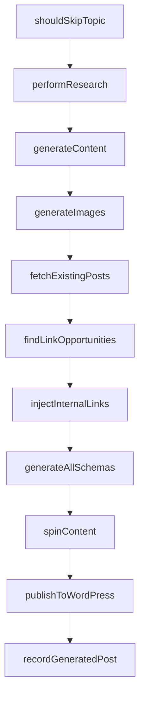
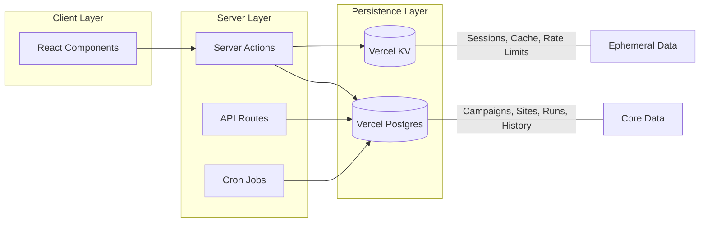

# Ifrit V3 Enterprise Architecture Deep Analysis & Revamp Plan

> **Analysis Date:** January 5, 2026  
> **Objective:** Enterprise-grade 24/7 production system on Vercel  
> **Methodology:** Multi-phase deep function logic analysis grounded in 2026 Next.js/Vercel best practices

---

## Executive Summary

This document presents a comprehensive, function-level analysis of every feature in the Ifrit application, identifying architectural gaps and proposing enterprise-grade refactoring strategies. The analysis is grounded in **2026 Next.js 16** and **Vercel deployment** best practices.

### Critical Findings

| Issue | Severity | Impact | Proposed Solution |
|-------|----------|--------|-------------------|
| All 8 Zustand stores use `localStorage` | 🔴 Critical | Blocks cron jobs, server-side operations | Migrate to Vercel Postgres / Server-side storage |
| Client-side API key management | 🔴 Critical | Security risk, incompatible with serverless | Server-side key vault with encrypted storage |
| No cron job implementation | 🟠 High | No 24/7 autonomous operation | Vercel Cron Jobs with `CRON_SECRET` |
| Mixed server/client boundaries | 🟠 High | Bundle bloat, hydration issues | Strict RSC/Client Component separation |
| Legacy Websites feature | 🟡 Medium | Dead code, confusion | Complete removal |

---

## Part 1: Deep Function Logic Analysis by Feature

### 1.1 Campaigns Feature (`features/campaigns/`)

**Total Files Analyzed:** 28+ lib files, 2 model files, 4 API routes  
**Total Lines of Code:** ~6,500 lines

#### 1.1.1 Core Processing Pipeline

##### [generators.ts](file:///home/ubuntu/Documents/AdSence%20Ifrit%20V3%20Opus4.5/features/campaigns/lib/generators.ts) (514 lines)

| Function | Lines | Logic Summary | Issues | Refactoring Required |
|----------|-------|---------------|--------|---------------------|
| `performResearch` | 20-45 | Fetches API key client-side via `getCapabilityKey()`, calls `/api/capabilities/research` | 🔴 Client-side key retrieval breaks server execution | Move to server action with context.apiKey |
| `generateContent` | 80-150 | Builds HTML prompt, calls `/api/capabilities/generate` | 🔴 Same key issue; `Buffer` usage for images | Refactor to server action |
| `generateImages` | 160-220 | Orchestrates cover/inline image generation with fallback chain | 🟡 Sequential fallback (slow) | Parallel attempts with timeout |
| `generateSingleImage` | 225-280 | Calls `/api/capabilities/images` or `/api/capabilities/search-images` | 🔴 Client-side key | Server action |
| `publishToWordPress` | 300-420 | Uploads media, creates WP post via REST API | 🟠 `Buffer.from()` in serverless context | Use `Uint8Array` for Edge compatibility |
| `retryImagesForPost` | 440-514 | Regenerates images for existing post | 🟡 Full post update vs patch | Use partial update |

**Refactoring Strategy:**
```typescript
// BEFORE (Client-Side Execution Pattern)
export async function performResearch(topic: string, aiConfig: AIConfig) {
    const apiKey = await getCapabilityKey('gemini'); // ❌ Client-side
    const response = await fetch('/api/capabilities/research', { ... });
}

// AFTER (Server Action Pattern - Next.js 16)
'use server'
export async function performResearch(topic: string, aiConfig: AIConfig) {
    const apiKey = await getServerSideKey('gemini'); // ✅ Server vault
    const result = await aiServices.execute({
        capability: 'research',
        context: { apiKey },
        ...
    });
}
```

##### [processor.ts](file:///home/ubuntu/Documents/AdSence%20Ifrit%20V3%20Opus4.5/features/campaigns/lib/processor.ts) (190 lines)

| Function | Lines | Logic Summary | Issues |
|----------|-------|---------------|--------|
| `runPipeline` | 15-170 | Main pipeline: dedup → research → content → images → links → schema → spin → publish | 🟠 Sequential execution; no checkpointing |
| `createRun` | 175-190 | Creates campaign run record | 🔴 Uses `campaignStore` (localStorage) |

**Pipeline Steps (Current Flow):**


**Enterprise Refactoring:**
- Add **checkpointing** at each stage for resume capability
- Implement **parallel stages** where possible (images + schema)
- Use **database transactions** for atomicity

##### [campaignStore.ts](file:///home/ubuntu/Documents/AdSence%20Ifrit%20V3%20Opus4.5/features/campaigns/model/campaignStore.ts) (319 lines)

| Function | Lines | Logic Summary | Critical Issue |
|----------|-------|---------------|----------------|
| `createCampaign` | 35-60 | Creates campaign with timestamps | 🔴 `localStorage` only |
| `getDueCampaigns` | 180-210 | Compares `nextRun` vs current time | 🔴 Cannot run server-side (no `localStorage`) |
| `addRun`, `updateRun`, `completeRun` | 220-280 | Run history management | 🔴 Lost on browser close |
| `clearOldRuns` | 290-319 | Cleanup runs older than 30 days | 🟡 Never runs automatically |

**Store Persistence Pattern (Current - BROKEN for Server):**
```typescript
export const useCampaignStore = create<CampaignStore>()(
    persist(
        (set, get) => ({ ... }),
        {
            name: 'campaigns-storage',  // ❌ localStorage key
            partialize: (state) => ({
                campaigns: state.campaigns,
                runs: state.runs,  // ❌ Lost if user clears browser
            }),
        }
    )
);
```

---

#### 1.1.2 Content Processing

##### [humanizer.ts](file:///home/ubuntu/Documents/AdSence%20Ifrit%20V3%20Opus4.5/features/campaigns/lib/humanizer.ts) (304 lines)

| Function | Logic | Quality |
|----------|-------|---------|
| `humanizeContent` | Orchestrates 5 transformation passes | ✅ Well-structured |
| `removeAIPatterns` | Regex replacement of 30+ AI phrases | ✅ Good pattern list |
| `addContractions` | Word-by-word contraction conversion | ✅ Works well |
| `addConversationalHooks` | Injects engagement phrases at paragraph boundaries | 🟡 Can over-inject |
| `varySentenceStructure` | Breaks long sentences at conjunctions | 🟡 Aggressive splitting |
| `addEEATSignals` | Adds first-person experience statements | ✅ Important for SEO |

**Refactoring:** This module is **well-designed** but runs client-side. Move to server action for cron job compatibility.

##### [contentSpinner.ts](file:///home/ubuntu/Documents/AdSence%20Ifrit%20V3%20Opus4.5/features/campaigns/lib/contentSpinner.ts) (209 lines)

| Function | Logic | Issues |
|----------|-------|--------|
| `spinContent` | AI-based rewriting via `/api/capabilities/generate` | 🔴 Client-side fetch |
| `buildSpinPrompt` | Constructs rewrite prompt by mode (light/moderate/heavy) | ✅ Good |
| `quickSpin` | Non-AI synonym replacement | ✅ Fast fallback |
| `calculateSimilarity` | Jaccard similarity scoring | ✅ Good metric |

##### [deduplication.ts](file:///home/ubuntu/Documents/AdSence%20Ifrit%20V3%20Opus4.5/features/campaigns/lib/deduplication.ts) (264 lines)

| Function | Logic | Issues |
|----------|-------|--------|
| `useDeduplicationStore` | Zustand store with hash-based duplicate detection | 🔴 `localStorage` persistence |
| `shouldSkipTopic` | Checks similarity threshold (default 0.7) | ✅ Good algorithm |
| `recordGeneratedPost` | Adds to dedup database | 🔴 Store-dependent |

**Critical:** Deduplication is essential for 24/7 operation but **cannot work** without server-side storage.

---

#### 1.1.3 Translation Pipeline

##### [translationPipeline.ts](file:///home/ubuntu/Documents/AdSence%20Ifrit%20V3%20Opus4.5/features/campaigns/lib/translationPipeline.ts) (284 lines)

| Function | Logic | Quality |
|----------|-------|---------|
| `runTranslationPipeline` | Full workflow: fetch → translate → humanize → publish | ✅ Well-structured |
| `isAlreadyTranslated` | BI duplicate prevention using translation history | ✅ Good SoC |
| `createTranslationRecord` | Creates tracking record per language/site | ✅ |
| `updateTranslationStatus` | Status machine: pending → translating → published/failed | ✅ |

**Architecture:** This is a **good example** of proper FSD patterns. The translation history store (`translationHistory.ts`) should be migrated to database but the logic is solid.

---

#### 1.1.4 Campaign Enrichment

##### [campaignEnrichment.ts](file:///home/ubuntu/Documents/AdSence%20Ifrit%20V3%20Opus4.5/features/campaigns/lib/campaignEnrichment.ts) (361 lines)

| Function | Logic | Quality |
|----------|-------|---------|
| `getEnrichedContext` | JIT enrichment from Hunt → Campaign context | ✅ Priority chain works |
| `runEnrichmentPipeline` | Executes capability steps with conditions | ✅ Good design |
| `enrichKeywordResearch` | On-demand keyword research via AI | 🔴 Uses `aiServices.execute` client-side |
| `enrichCompetition` | Competition analysis via AI | 🔴 Same issue |
| `enrichContentSuggestions` | Content gap analysis | 🔴 Same issue |

---

### 1.2 WordPress Feature (`features/wordpress/`)

**Total Files Analyzed:** 15+ files  
**Total Lines:** ~3,500 lines

#### 1.2.1 Core Store

##### [wpSiteStore.ts](file:///home/ubuntu/Documents/AdSence%20Ifrit%20V3%20Opus4.5/features/wordpress/model/wpSiteStore.ts) (495 lines)

| Function | Logic | Issues |
|----------|-------|--------|
| `addSite` | Creates WPSite with credentials | 🔴 Stores `appPassword` in localStorage |
| `updateSite` | Updates site properties | 🔴 Same |
| `syncSiteData` | Syncs categories, tags, authors from WP | ✅ Good API usage |
| `loadHuntProfile` | Consumes Hunt artifacts into site profile | ✅ Good feature integration |
| `updateEssentialPages` | Tracks About, Privacy, etc. pages | ✅ AdSense readiness |

**Security Issue:** WordPress Application Passwords are stored in `localStorage`:
```typescript
// CURRENT (INSECURE)
const site: WPSite = {
    username: input.username,
    appPassword: input.appPassword,  // ❌ Plaintext in browser storage
    ...
};
```

**Required:** Encrypted storage with server-side decryption for API calls.

#### 1.2.2 API Client

##### [wordpressApi.ts](file:///home/ubuntu/Documents/AdSence%20Ifrit%20V3%20Opus4.5/features/wordpress/api/wordpressApi.ts) (420 lines)

| Function | Logic | Quality |
|----------|-------|---------|
| `wpFetch` | Base HTTP client with Basic Auth | ✅ Good abstraction |
| `testConnection` | Two-phase test: REST availability then auth | ✅ Good UX |
| `createPost` | POST to /wp/v2/posts | ✅ |
| `uploadMedia` | Multipart form upload | 🟠 FormData construction |
| `syncSiteMetadata` | Parallel fetch of cats/tags/authors | ✅ Good optimization |

**Note:** This module is **well-designed** and can run server-side. The issue is obtaining credentials securely.

---

### 1.3 Hunt Feature (`features/hunt/`)

**Total Files Analyzed:** 8 model files, 2 lib files  
**Total Lines:** ~4,000 lines

#### 1.3.1 Core Store

##### [huntStore.ts](file:///home/ubuntu/Documents/AdSence%20Ifrit%20V3%20Opus4.5/features/hunt/model/huntStore.ts) (502 lines)

| Function | Logic | Issues |
|----------|-------|--------|
| `addToAnalyze` | Adds domains to analysis queue | 🔴 localStorage |
| `addToPurchase` | Moves from analyze to purchase queue | 🔴 localStorage |
| `purchaseAndGenerateProfile` | Triggers AI profile generation | 🔴 Uses dynamic import of API |
| `updateProfileStatus` | State machine for profile generation | ✅ Good |
| `retryGenerateProfile` | Retry failed profile generation | ✅ Good resilience |

**Custom Storage Implementation (Lines 437-452):**
```typescript
storage: {
    getItem: (name) => {
        if (typeof window === 'undefined') return null;  // ❌ SSR guard
        const str = localStorage.getItem(name);
        return str ? JSON.parse(str) : null;
    },
    setItem: (name, value) => {
        if (typeof window === 'undefined') return;  // ❌ Server blocked
        localStorage.setItem(name, JSON.stringify(value));
    },
    ...
}
```

#### 1.3.2 Launch Workflow

##### [launchWorkflow.ts](file:///home/ubuntu/Documents/AdSence%20Ifrit%20V3%20Opus4.5/features/hunt/lib/launchWorkflow.ts) (288 lines)

| Function | Logic | Quality |
|----------|-------|---------|
| `launchCampaignFromHunt` | Creates campaign from Hunt data | ✅ Good integration |
| `buildSourcesFromHunt` | Converts keywords/trends to campaign sources | ✅ |
| `buildAIConfig` | Constructs AI config with niche context | ✅ |
| `quickLaunch` | One-click launch with defaults | ✅ Good UX |
| `getReadyToLaunchDomains` | Finds domains ready for campaigns | 🔴 Uses store.getState() client-side |

---

### 1.4 Hosting Feature (`features/hosting/`)

**Total Files Analyzed:** 3 files  
**Total Lines:** ~600 lines

#### 1.4.1 Hostinger MCP Integration

##### [hostingerMcp.ts](file:///home/ubuntu/Documents/AdSence%20Ifrit%20V3%20Opus4.5/features/hosting/lib/hostingerMcp.ts) (288 lines)

| Function | Logic | Quality |
|----------|-------|---------|
| `callHostingerTool` | Executes MCP tools via `/api/mcp/execute` | ✅ Good abstraction |
| `listWebsites` | Lists Hostinger websites | ✅ |
| `createWordPressSite` | Creates new WP site on Hostinger | ✅ |
| `deployPlugin`, `deployTheme` | Installs WP plugins/themes | ✅ |
| `purchaseDomain` | Domain registration | 🟡 May need better error handling |

**Architecture:** This module is **well-designed** for server execution and properly uses the MCP system.

##### [siteProvision.ts](file:///home/ubuntu/Documents/AdSence%20Ifrit%20V3%20Opus4.5/features/hosting/lib/siteProvision.ts) (296 lines)

| Function | Logic | Issues |
|----------|-------|--------|
| `provisionSite` | Full orchestration: check → verify → create → DNS → plugins → register | ✅ Good |
| `registerInIfrit` | Registers site in local storage | 🔴 Uses `localStorage` directly |
| `canProvision` | Pre-flight check | ✅ |

---

### 1.5 AI Services Infrastructure (`lib/ai/services/`)

**Critical Component:** This is the brain of all AI operations.

##### [AIServices.ts](file:///home/ubuntu/Documents/AdSence%20Ifrit%20V3%20Opus4.5/lib/ai/services/AIServices.ts) (1229 lines)

| Function | Lines | Logic | Issues |
|----------|-------|-------|--------|
| `initialize` | 64-91 | Loads config, registers handlers | 🔴 Loads from localStorage |
| `loadConfig` | 97-119 | Gets config from settingsStore | 🔴 Client-side store |
| `registerAIProviderHandlers` | 275-400 | Registers Gemini, DeepSeek, Perplexity, OpenRouter | ✅ Good handler pattern |
| `execute` | 453-528 | Main execution with handler fallback chain | ✅ Good resilience |
| `executeAggregate` | 535-651 | Parallel multi-handler execution | ✅ Good for trend scanning |
| `executeWithAIProvider` | 717-875 | Server vs client execution path | 🟠 Complex branching |
| `executeProviderDirect` | 910-1038 | Direct provider SDK usage | ✅ Server-compatible |

**Dual Execution Path (Lines 722-783):**
```typescript
private async executeWithAIProvider(...) {
    const isServer = typeof window === 'undefined';
    
    if (isServer) {
        // ✅ Direct SDK execution - GOOD
        let apiKey = options.context?.apiKey;
        if (!apiKey) {
            const { keyManager } = await import('@/lib/keys');
            const key = keyManager.getKey(handler.providerId);
            // ...
        }
    } else {
        // ❌ Client fetch - PROBLEMATIC
        const response = await fetch('/api/ai/generate', { ... });
    }
}
```

---

### 1.6 Settings Store (`stores/settingsStore.ts`)

##### [settingsStore.ts](file:///home/ubuntu/Documents/AdSence%20Ifrit%20V3%20Opus4.5/stores/settingsStore.ts) (708 lines)

| Function | Logic | Issues |
|----------|-------|--------|
| `addProviderKey` | Stores API key in array | 🔴 Plaintext in localStorage |
| `exportSettings` | Exports all settings to JSON | 🟡 Exports secrets |
| `importSettings` | Restores from export file | 🟡 Imports secrets |
| `backupToServer` | Posts to `/api/settings/backup` | ✅ Good |
| `migrateFromLegacy` | Migrates from old localStorage keys | ✅ Good migration |

**Sensitive Data in Browser Storage:**
```typescript
// Currently stored in localStorage (INSECURE)
interface IntegrationConfig {
    githubToken: string;      // ❌ PAT token
    vercelToken: string;      // ❌ API token  
    spamzillaKey: string;     // ❌ API key
    namecheapKey: string;     // ❌ API key
    godaddyKey: string;       // ❌ API key
    // ... more secrets
}
```

---

## Part 2: Gap Analysis & 2026 Best Practices

### 2.1 Next.js 16 Best Practices (2026)

Based on current research, the following Next.js 16 features should be adopted:

| Feature | Current State | Required State | Priority |
|---------|---------------|----------------|----------|
| **Turbopack** | Not configured | Enable for 2-5x faster builds | 🟡 Medium |
| **`use cache` directive** | Not used | Implement for granular caching control | 🟡 Medium |
| **Server Actions** | Minimal usage | Primary pattern for mutations | 🔴 High |
| **RSC Data Fetching** | Mixed patterns | Server-side data in RSC | 🔴 High |
| **Edge Middleware** | Not used | Rate limiting, auth checks | 🟠 Medium |

### 2.2 Vercel Deployment Best Practices (2026)

| Feature | Current State | Required State | Priority |
|---------|---------------|----------------|----------|
| **Vercel Cron Jobs** | Not implemented | Required for 24/7 automation | 🔴 Critical |
| **CRON_SECRET** | Not configured | Required for cron security | 🔴 Critical |
| **Vercel Postgres** | Not used (localStorage) | Core persistence layer | 🔴 Critical |
| **Vercel KV** | Not used | Caching, rate limiting, sessions | 🟠 High |
| **Edge Config** | Not used | Feature flags, configuration | 🟡 Medium |

### 2.3 Persistence Architecture Decision

Based on 2026 research, the recommended architecture is:



**Rationale:**
- **Vercel Postgres** (Neon-backed): Full ACID compliance, complex queries, relational integrity for campaigns, sites, run history
- **Vercel KV** (Redis-backed): Session storage, rate limiting, caching, feature flags

---

## Part 3: Refactoring Plan by Priority

### Phase 1: Critical Infrastructure (Week 1-2)

#### 1.1 Database Schema Migration

Create Vercel Postgres schema for all persisted data:

```sql
-- Campaigns
CREATE TABLE campaigns (
    id UUID PRIMARY KEY DEFAULT gen_random_uuid(),
    name VARCHAR(255) NOT NULL,
    status VARCHAR(50) DEFAULT 'paused',
    target_site_id UUID REFERENCES wp_sites(id),
    source JSONB NOT NULL,
    ai_config JSONB NOT NULL,
    schedule JSONB,
    stats JSONB DEFAULT '{}',
    hunt_context JSONB,
    created_at TIMESTAMPTZ DEFAULT NOW(),
    updated_at TIMESTAMPTZ DEFAULT NOW()
);

-- Campaign Runs
CREATE TABLE campaign_runs (
    id UUID PRIMARY KEY DEFAULT gen_random_uuid(),
    campaign_id UUID REFERENCES campaigns(id) ON DELETE CASCADE,
    status VARCHAR(50) DEFAULT 'running',
    started_at TIMESTAMPTZ DEFAULT NOW(),
    completed_at TIMESTAMPTZ,
    items JSONB DEFAULT '[]',
    errors JSONB DEFAULT '[]',
    stats JSONB DEFAULT '{}'
);

-- WordPress Sites
CREATE TABLE wp_sites (
    id UUID PRIMARY KEY DEFAULT gen_random_uuid(),
    name VARCHAR(255) NOT NULL,
    url VARCHAR(500) NOT NULL,
    username VARCHAR(255) NOT NULL,
    app_password_encrypted BYTEA NOT NULL,  -- Encrypted!
    status VARCHAR(50) DEFAULT 'pending',
    niche VARCHAR(255),
    site_type VARCHAR(50),
    hosting_provider VARCHAR(50),
    profile_data JSONB,
    adsense_status VARCHAR(50),
    created_at TIMESTAMPTZ DEFAULT NOW(),
    updated_at TIMESTAMPTZ DEFAULT NOW()
);

-- Deduplication Records
CREATE TABLE dedup_records (
    id UUID PRIMARY KEY DEFAULT gen_random_uuid(),
    campaign_id UUID REFERENCES campaigns(id),
    site_id UUID REFERENCES wp_sites(id),
    topic_hash VARCHAR(64) NOT NULL,
    title VARCHAR(500),
    slug VARCHAR(500),
    wp_post_id INTEGER,
    created_at TIMESTAMPTZ DEFAULT NOW(),
    UNIQUE(campaign_id, site_id, topic_hash)
);

-- Hunt Owned Domains
CREATE TABLE hunt_domains (
    id UUID PRIMARY KEY DEFAULT gen_random_uuid(),
    domain VARCHAR(255) NOT NULL UNIQUE,
    tld VARCHAR(20),
    score INTEGER,
    estimated_value INTEGER,
    purchased_at TIMESTAMPTZ,
    profile_status VARCHAR(50) DEFAULT 'pending',
    profile JSONB,
    site_created BOOLEAN DEFAULT FALSE,
    created_at TIMESTAMPTZ DEFAULT NOW()
);

-- Encrypted Settings Vault
CREATE TABLE settings_vault (
    key VARCHAR(255) PRIMARY KEY,
    value_encrypted BYTEA NOT NULL,
    provider VARCHAR(50),
    created_at TIMESTAMPTZ DEFAULT NOW(),
    updated_at TIMESTAMPTZ DEFAULT NOW()
);
```

#### 1.2 Server Actions Migration

Convert all client-side operations to Server Actions:

```typescript
// app/actions/campaigns.ts
'use server'

import { db } from '@/lib/db';
import { aiServices } from '@/lib/ai/services';
import { getDecryptedKey } from '@/lib/vault';

export async function runCampaignPipeline(campaignId: string, sourceItemId: string) {
    const campaign = await db.campaigns.findUnique({ where: { id: campaignId } });
    const apiKey = await getDecryptedKey('gemini');
    
    // Run pipeline with server-side key
    const result = await aiServices.execute({
        capability: 'generate',
        context: { apiKey },
        ...
    });
    
    // Update database
    await db.campaign_runs.update({
        where: { id: sourceItemId },
        data: { status: 'completed', ...result }
    });
    
    return result;
}
```

#### 1.3 Vercel Cron Jobs Setup

Create cron job infrastructure:

```json
// vercel.json
{
    "crons": [
        {
            "path": "/api/cron/run-campaigns",
            "schedule": "*/15 * * * *"
        },
        {
            "path": "/api/cron/cleanup-old-runs",
            "schedule": "0 3 * * *"
        },
        {
            "path": "/api/cron/sync-site-health",
            "schedule": "0 */6 * * *"
        }
    ]
}
```

```typescript
// app/api/cron/run-campaigns/route.ts
import { NextRequest, NextResponse } from 'next/server';
import { db } from '@/lib/db';
import { runCampaignPipeline } from '@/app/actions/campaigns';

export async function GET(request: NextRequest) {
    // Verify cron secret
    const authHeader = request.headers.get('authorization');
    if (authHeader !== `Bearer ${process.env.CRON_SECRET}`) {
        return NextResponse.json({ error: 'Unauthorized' }, { status: 401 });
    }
    
    // Get due campaigns from database
    const dueCampaigns = await db.campaigns.findMany({
        where: {
            status: 'active',
            schedule: {
                path: ['nextRun'],
                lt: new Date().toISOString()
            }
        }
    });
    
    const results = [];
    for (const campaign of dueCampaigns) {
        try {
            const result = await runCampaignPipeline(campaign.id, '...');
            results.push({ campaignId: campaign.id, success: true });
        } catch (error) {
            results.push({ campaignId: campaign.id, success: false, error: String(error) });
        }
    }
    
    return NextResponse.json({ processed: results.length, results });
}
```

---

### Phase 2: Security Hardening (Week 2-3)

#### 2.1 Encrypted Key Vault

```typescript
// lib/vault/index.ts
import { db } from '@/lib/db';
import { encrypt, decrypt } from './crypto';

export async function storeKey(provider: string, key: string): Promise<void> {
    const encrypted = await encrypt(key, process.env.VAULT_ENCRYPTION_KEY!);
    await db.settings_vault.upsert({
        where: { key: `${provider}_api_key` },
        update: { value_encrypted: encrypted },
        create: { key: `${provider}_api_key`, value_encrypted: encrypted, provider }
    });
}

export async function getDecryptedKey(provider: string): Promise<string | null> {
    const record = await db.settings_vault.findUnique({
        where: { key: `${provider}_api_key` }
    });
    if (!record) return null;
    return decrypt(record.value_encrypted, process.env.VAULT_ENCRYPTION_KEY!);
}
```

#### 2.2 WordPress Credential Security

```typescript
// Store encrypted in database
export async function storeWPCredentials(siteId: string, username: string, appPassword: string) {
    const encrypted = await encrypt(appPassword, process.env.VAULT_ENCRYPTION_KEY!);
    await db.wp_sites.update({
        where: { id: siteId },
        data: { username, app_password_encrypted: encrypted }
    });
}

// Decrypt only when needed for API calls
export async function getWPCredentials(siteId: string) {
    const site = await db.wp_sites.findUnique({ where: { id: siteId } });
    if (!site) return null;
    return {
        username: site.username,
        appPassword: await decrypt(site.app_password_encrypted, process.env.VAULT_ENCRYPTION_KEY!)
    };
}
```

---

### Phase 3: Store Migration (Week 3-4)

For each Zustand store, create a database-backed replacement:

| Current Store | Database Table | Migration Strategy |
|---------------|----------------|-------------------|
| `campaignStore` | `campaigns`, `campaign_runs` | Full migration |
| `wpSiteStore` | `wp_sites` | Full migration |
| `huntStore` | `hunt_domains`, `hunt_keywords` | Full migration |
| `deduplicationStore` | `dedup_records` | Full migration |
| `settingsStore` | `settings_vault` | Secrets only; UI prefs stay client |
| `trendStore` | `trends` (optional) | Consider KV for ephemeral |
| `keywordStore` | `keywords` | Full migration |

---

### Phase 4: Server/Client Separation (Week 4-5)

Apply strict RSC patterns:

```typescript
// BEFORE: Mixed component
export default function CampaignDashboard() {
    const { campaigns } = useCampaignStore();  // ❌ Client store
    // ...
}

// AFTER: RSC + Client Components
// app/campaigns/page.tsx (Server Component)
import { db } from '@/lib/db';
import { CampaignList } from './CampaignList';

export default async function CampaignsPage() {
    const campaigns = await db.campaigns.findMany();  // ✅ Server fetch
    return <CampaignList initialCampaigns={campaigns} />;
}

// app/campaigns/CampaignList.tsx (Client Component)
'use client'
export function CampaignList({ initialCampaigns }) {
    const [campaigns, setCampaigns] = useState(initialCampaigns);
    // Interactive client logic only
}
```

---

### Phase 5: Legacy Cleanup (Week 5-6)

#### 5.1 Remove Deprecated Features

Per `deprecated.md`, remove Legacy Websites system:
- `/app/(dashboard)/websites/` - Delete entire route group
- `/app/api/websites/` - Remove all 24 API routes
- `/features/websites/` - If exists, remove
- Update navigation to remove Websites tab

#### 5.2 Code Cleanup

- Remove unused imports
- Delete dead code paths
- Update type definitions
- Fix ESLint warnings

---

## Part 4: Verification Plan

### 4.1 Automated Tests

```typescript
// __tests__/cron/run-campaigns.test.ts
describe('Campaign Cron Job', () => {
    it('should process due campaigns', async () => {
        // Create test campaign with past nextRun
        // Trigger cron endpoint
        // Verify campaign was processed
    });
    
    it('should reject unauthorized requests', async () => {
        const response = await fetch('/api/cron/run-campaigns');
        expect(response.status).toBe(401);
    });
});
```

### 4.2 Manual Verification

1. **Cron Job Execution:** Deploy to Vercel, verify cron runs in dashboard
2. **Data Persistence:** Create campaign, close browser, reopen - data intact
3. **Key Security:** Verify API keys not visible in browser DevTools
4. **24/7 Operation:** Leave running overnight, verify autonomous publishing

---

## Part 5: Implementation Timeline

| Week | Phase | Deliverables |
|------|-------|-------------|
| 1 | Database Setup | Schema deployed, Prisma configured |
| 2 | Core Migration | campaignStore, wpSiteStore migrated |
| 2-3 | Security | Vault implemented, credentials secured |
| 3-4 | Remaining Stores | All stores migrated |
| 4-5 | RSC Patterns | Components refactored |
| 5-6 | Cron Jobs | All automation working |
| 6 | Testing & Cleanup | Full verification, legacy removal |

---

## Appendix: File Inventory

### Files Requiring Major Refactoring

| File | Lines | Change Type |
|------|-------|-------------|
| `features/campaigns/model/campaignStore.ts` | 319 | Full rewrite to DB-backed |
| `features/wordpress/model/wpSiteStore.ts` | 495 | Full rewrite + encryption |
| `features/hunt/model/huntStore.ts` | 502 | Full rewrite |
| `features/campaigns/lib/deduplication.ts` | 264 | Full rewrite |
| `stores/settingsStore.ts` | 708 | Partial rewrite (vault only) |
| `lib/ai/services/AIServices.ts` | 1229 | Key loading refactor |

### Files Requiring Minor Updates

| File | Lines | Change Type |
|------|-------|-------------|
| `features/campaigns/lib/generators.ts` | 514 | Add Server Action wrappers |
| `features/campaigns/lib/processor.ts` | 190 | Add checkpointing |
| `features/campaigns/lib/humanizer.ts` | 304 | Move to server |
| `features/campaigns/lib/contentSpinner.ts` | 209 | Move to server |

### Files Requiring No Changes

| File | Lines | Notes |
|------|-------|-------|
| `features/wordpress/api/wordpressApi.ts` | 420 | Already server-compatible |
| `features/hosting/lib/hostingerMcp.ts` | 288 | Good architecture |
| `features/campaigns/lib/htmlPrompts.ts` | 314 | Pure functions |
